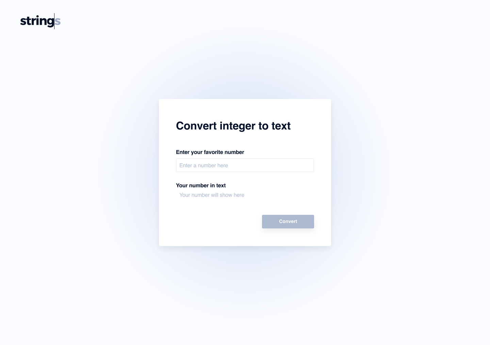

# Strings Engineering
## Vue Front-End Coding Exercise

## Overview
This exercise serves as a demonstration of how you solve problems using idiomatic Vue.js and Typescript or ECMAScript. Your solution will be used to facilitate a conversation on a follow-up technical interview.

## Rules
There are a few guidelines to follow while completing this exercise:
* __Keep It Confidential:__ Please keep this document, the problem, and your solution confidential between yourself and Recursive Rebels (d.b.a. Strings), even after leaving the interview
* __24-hour Time Limit:__ This should be a relatively short but fun exercise to show of your knowledge about specific technologies and software engineering principles.  Unless otherwise arranged, make handoff to Strings within 24 hours,
* __Use Generally Available Tools:__ The team evaluates new releases of tools and technologies as they become available, however for this exercise, please only use the latest version of tools and technologies that are considered Generally Available,
* __Open Documentation, Open Internet:__ Engineers spend a non-trivial amount of time sourcing information online; feel free to use online resources and be able to demonstrate why you selected one approach to solving a problem over another,
* __Deliver a Complete Project:__ The solution is delivered via a pull request. [Fork](https://docs.github.com/en/github/collaborating-with-issues-and-pull-requests/creating-a-pull-request-from-a-fork) the repository into your own, create the code, 
  test cases, and any supporting documentation required to build the project should be standardized in your project resources -- We want to be able to run your solution on our machines.

## Technical Requirements
All software projects require careful balance of both technical requirements along with functional requirements.  Your solution must comply with the following technical objectives:
* Implement your solution using a current released version of Vue and Typescript or ECMAScript,
* Must include unit tests to verify your code and include these tests in your solution,
* There is no need to provide any form of data persistence, or API.

We are looking for a **clean**, **well-factored**, idiomatic codebase that has accompanying unit tests, and a thoughtful design consistent with provided assets.

Good luck! 

## Functional Requirements
### Part 1
We would like a function that translates integers into strings that are [English numerals](https://en.wikipedia.org/wiki/English_numerals).   
For example, you can envision a function accepting an int and returning a string such that:
| Input | Output |
| ---: | ------ |
| 0    | Zero   |
| 10   | Ten    |
| 11   | Eleven |
| 55   | Fifty-five |
| 123  | One hundred and twenty-three |
| 1234 | One thousand two hundred and thirty-four | 
| 85000 | Eighty-five thousand | 

The following are the guard rails:  
* Minimum number is 0
* Maximum number is 999,999,999
* If a number group is in the range 21 to 99, and the second digit is not zero, the number is typically written as two words separated by a hyphen.

### Part 2
Stand up a new vue.js project with a simple component structure that aligns with [this Figma design](https://www.figma.com/file/uaXKogIMrylzQftufl7vMu/Take-home-exercise).

The input of numbers in this dialog invokes the function created in Part 1 and the response of the function is the output in this design.

Notes:
* View is full screen, desktop only. There are no responsive requirements.
* Fonts, weights, dimensions, boxes are all important details and included in the Figma designs.
* We can run the app locally, please do not host your app. We want to maintain privacy and keep this exercise private for future recruiting purposes.  

